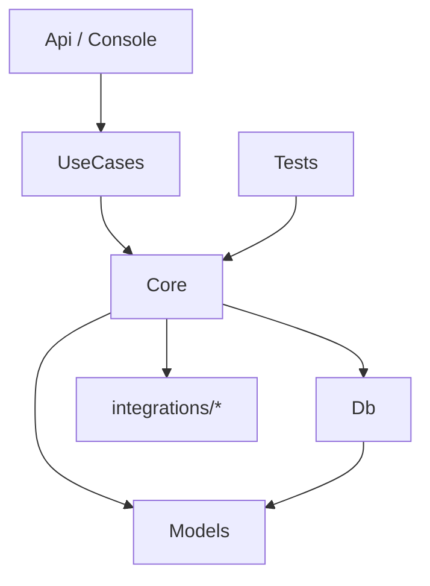

# Architettura

## Struttura della solution

Non esiste un'architettura unica imposta, ma esistono basi minime che ogni soluzione deve rispettare. Ogni progetto ha una responsabilità precisa:

- **Models** — DTO, enum di dominio, `Result<T>`. Tipi puri condivisi tra i progetti.
- **Db** — DbContext, entità di dominio, Fluent API, migration.
- **Core** — domain service, validator, use case, DI extension organizzati per dominio.
- **Api / Console / Worker** — progetti di alto livello, composition root.
- **integrations/*** — progetti che isolano client HTTP/SOAP e librerie esterne.
- **Tests** — test di integrazione.

I dettagli tecnici (file system, naming, `.csproj`, configurazione DI per dominio) vivono in [`tecnologie/csharp/struttura-soluzione`](../tecnologie/csharp/struttura-soluzione/01-struttura-fisica.md).

## Regole di dipendenza

Le dipendenze hanno una direzione precisa e non si invertono:



- **Models** non dipende da nessuno. È la base trasversale referenziata da Db e Core.
- **Db** dipende da Models — gli enum di dominio sono usati nelle entità.
- **Core** dipende da Db, Models e dai progetti di integrazione. Usa il DbContext direttamente (no repository pattern) e le interfacce esposte dalle integrazioni.
- **UseCases** è il livello tra Core e i progetti di alto livello. Contiene i comandi completi che chiudono la unit of work. Spesso vive come sottocartella di Core, può diventare progetto first-class quando cresce.
- **Api e Console** dipendono da UseCases. Sono il composition root: registrano via DI le dipendenze concrete e non chiudono mai transazioni.
- **Tests** dipende da Core e ottiene tutto il resto transitivamente (UseCases come sottocartella, Db, Models, integrazioni).

Se un progetto di alto livello contiene business logic o chiama `SaveChanges`, quella logica è nel posto sbagliato.

## Core

Il progetto Core contiene la logica di dominio, organizzata per dominio (Screaming Architecture):

- **Domain service** — comportamenti che operano sulle entità (definite in Db)
- **Validator** — regole di validazione per i DTO di input
- **Use case** — comandi completi (in `Core/UseCases/` o nel progetto separato `usecases/`)
- **DI extension** — un extension method per cartella di dominio (`AddOrdini()`, `AddClienti()`)

Le entità non vivono in Core: stanno in Db, vicine al DbContext. I DTO ed enum stanno in Models. Vedi [`regole/dominio`](dominio.md) per le regole di modellazione.

## Db

Il progetto Db contiene la persistenza:

- il **DbContext** (Unit of Work) e le configurazioni Fluent API
- le **entità di dominio**
- le **migration**

Entity Framework è la libreria di accesso ai dati. Non esiste un repository pattern: Core usa direttamente il DbContext. Segue le regole descritte in [`regole/entity-framework`](entity-framework.md).

## Screaming Architecture

La struttura del codice deve comunicare immediatamente cosa fa il sistema, non come è costruito tecnicamente.

Aprire un progetto e vedere cartelle come `Controllers/`, `Services/`, `Repositories/` non comunica nulla sul dominio specifico dell'applicazione. Aprire un progetto e vedere `Ordini/`, `Fatturazione/`, `Clienti/` dice tutto.

Il nome di ogni modulo, cartella, classe e metodo deve rispondere alla domanda: **cosa fa?** Non "che tipo di oggetto è" — cosa fa nel contesto di questo sistema.

```
// Sbagliato: organizzato per tipo tecnico
Core/
  Services/
    OrdineService.cs
    ClienteService.cs

// Corretto: organizzato per dominio
Core/
  Ordini/
    GestoreScorte.cs
    OrdineValidator.cs
  Clienti/
    ClienteValidator.cs
```

Questo vale a tutti i livelli: struttura dei progetti, cartelle, classi, metodi, endpoint API. Se il nome richiede un commento per essere capito, il nome è sbagliato.

## Progetti di alto livello

Api, Console e simili hanno un unico compito: **orchestrare**. Ricevono input dall'esterno, invocano un caso d'uso (in UseCases), restituiscono output. Non contengono business logic, non chiudono transazioni.

Un progetto di alto livello che cresce troppo è un segnale che della logica è finita nel posto sbagliato.